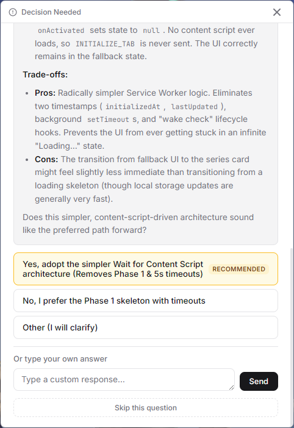

# Interactive Choice MCP Server (Native UI)

[](https://www.npmjs.com/package/mcp-interactive-choice)

A Model Context Protocol (MCP) server that allows AI agents to ask questions through a **native window** (built with Tauri), preventing context-breaking interruptions and providing a premium user experience.



## ✨ Features

- **Native Window**: A native window appears when the agent needs your input.
- **Markdown Support**: Detailed descriptions from the AI are rendered in markdown. HTML output is sanitized with [DOMPurify](https://github.com/cure53/DOMPurify) to prevent XSS.
- **Input Validation**: Tool arguments are validated at the protocol boundary using [zod](https://zod.dev) schemas. Invalid calls (e.g. empty `choices`) return a clear error instead of crashing.
- **Keyboard Navigation**: Fully accessible via keyboard. Use arrow keys to navigate choices, `Enter` to confirm, and `Shift+Enter` for new lines in custom input.
- **Cross-Platform**: Supports Windows and macOS.

## 🚀 Setup & Installation

<details>
<summary><b>AI agent? Read <a href="./AGENTS.md">AGENTS.md</a> instead</b></summary>

If you are an AI coding agent looking to install and use this MCP server in your project, follow the instructions in [`AGENTS.md`](./AGENTS.md) — it covers setup, configuration, the `ask_user` tool API, CLI flags, and client compatibility in a concise format designed for you.

</details>

### Requirements
- **Node.js** ≥ 20 (required by `commander` v14 and the MCP SDK)
- **Rust** toolchain (only needed for local builds of the native UI)

### Option A: Run with npx (Recommended)
You can use the server directly via `npx` in your MCP client configuration:

```json
{
  "mcpServers": {
    "interactive-choice": {
      "command": "npx",
      "args": [
        "-y",
        "mcp-interactive-choice"
      ]
    }
  }
}
```

### Option B: Local Build
#### 1. Build Everything
From the project root:
```bash
npm install
npm run build
```
This will:
1. Build the frontend (Vite)
2. Build the Tauri binary (Rust)
3. Compile the MCP server (TypeScript)
4. Copy the binary to the `bin/` folder

#### 2. Register with your MCP Client
Update your configuration (e.g., `claude_desktop_config.json`):

```json
{
  "mcpServers": {
    "interactive-choice": {
      "command": "node",
      "args": [
        "/path/to/mcp-interactive-choice/dist/index.js"
      ]
    }
  }
}
```

#### Optional: Enforce a server-side timeout globally
Pass `--timeout <seconds>` to the server to set a global cap on how long the native window waits for user input. Without this flag, the server waits indefinitely. Non-positive or non-numeric values are ignored (treated as no timeout):

```json
{
  "mcpServers": {
    "interactive-choice": {
      "command": "node",
      "args": [
        "/path/to/mcp-interactive-choice/dist/index.js",
        "--timeout", "120"
      ]
    }
  }
}
```

#### Optional: Prevent focus stealing globally
Pass `--silent` to the server to prevent the UI from "stealing" window focus every time it launches (useful if the agent frequently uses the tool):

```json
{
  "mcpServers": {
    "interactive-choice": {
      "command": "node",
      "args": [
        "/path/to/mcp-interactive-choice/dist/index.js",
        "--silent"
      ]
    }
  }
}
```

## 🛠️ Tool: `ask_user`

The agent calls this tool when it needs a human decision.

**Arguments:**
- `title` (optional): Short headline for the question.
- `body` (optional): Detailed context in Markdown. Rendered HTML is sanitized with DOMPurify.
- `choices` (required): A non-empty list of strings.
- `recommended` (optional): One of the strings from `choices` that the agent suggests. If provided, it must exactly match one of the `choices` (after trimming whitespace) or the call returns an error.

**Response:**
- Returns the string value of the selected choice.
- Returns `"User provided answer: {text}"` if the user typed a custom response.
- Returns `"User skipped the question"` if the user clicked Skip.
- Returns `"user cancelled the selection"` if the window is closed manually.

## 🛠️ Development & Debugging

### UI Development (Hot Reloading)
To iterate on the UI with hot reloading:
1. Go to `packages/native-ui`.
2. Run `npm run tauri dev`.

**Running with CLI parameters (Windows/PowerShell):**
To test specific data during development, use the flag `--input`:
```powershell
npm run tauri dev -- -- -- --input '{"title":"Dev Test","choices":["A","B"]}'
```

### 🔍 Testing with MCP Inspector
1. **Build Everything**: `npm run build` at the root.
2. **Run Inspector** from the project root:
```bash
npx -y @modelcontextprotocol/inspector node dist/index.js
```

## ⚠️ IDE / Client Compatibility

This server waits **indefinitely** by default. Whether that works depends on your MCP client:

| Client | Behavior |
|---|---|
| **Antigravity** (Google) | ✅ No client-side timeout — works perfectly |
| **VS Code / GitHub Copilot** | ✅ No hard timeout for MCP tool calls; uses cancellation tokens |
| **Claude Desktop** | ⚠️ Enforces a **60-second** client-side timeout via the MCP TypeScript SDK (DEFAULT_REQUEST_TIMEOUT_MSEC = 60000). The tool call will fail if the user doesn't respond in time. |
| **Cursor** | ⚠️ Also enforces a **60-second** client-side timeout. This is a known limitation being tracked upstream. |

> **Tip:** If your client enforces a 60-second timeout, pass --timeout 55 to this server. The server will then return a clean "Error: User feedback timed out." response *before* the client's timeout fires, producing a more graceful error than the client's raw -32001 cancellation.


## 📝 License
MIT